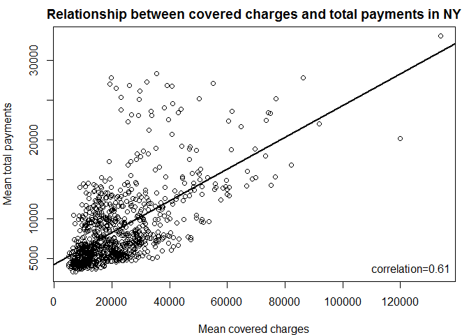
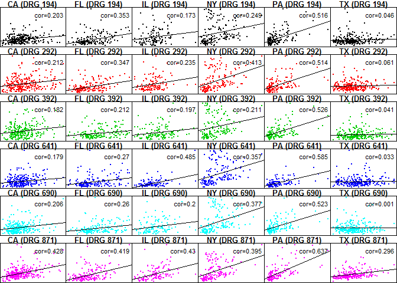

US-medical-expenditures
================

Relationship between covered charges and total payments by medical conditions and State from United States medical expenditures dataset with information on costs for different medical conditions and in different areas of the countryGitHub Documents

To make the plots use the data in the attached [payments.csv](payments.csv) file.

``` r
payments <- read.csv("payments.csv")[, c(1,6,10,11)]
```

These data are a processed version of the data from the site: <https://data.cms.gov/Medicare/Inpatient-Prospective-Payment-System-IPPS-Provider/97k6-zzx3>

Plot 1
------

A plot that answers the question: what is the relationship between mean covered charges (Average.Covered.Charges) and mean total payments (Average.Total.Payments) in New York?

### Scatterplot with Regression Line and Correlation

``` r
ny <- subset(payments, Provider.State=="NY")
correlation <- with(ny, cor(Average.Covered.Charges, Average.Total.Payments))
model <- lm(formula = Average.Total.Payments ~ Average.Covered.Charges, data = ny)
par(mfrow = c(1,1), mar=c(4,4,2,1))
plot(Average.Total.Payments ~ Average.Covered.Charges, data = ny,
     main="Relationship between covered charges and total payments in NY")
abline(reg = model, lwd = 2)
legend(x = "bottomright", legend = paste0("correlation=", round(correlation,2)), bty="n")
```



``` r
invisible(dev.copy2pdf(file = "plot1.pdf"))
```

Plot 2
------

A plot (possibly multi-panel) that answers the question: how does the relationship between mean covered charges (Average.Covered.Charges) and mean total payments (Average.Total.Payments) vary by medical condition (DRG.Definition) and the state in which care was received (Provider.State)?

### Checking correlations with dplyr and xtabs

``` r
library(dplyr, warn.conflicts = FALSE, quietly = TRUE)
payments %>%
    group_by(DRG.Definition, Provider.State) %>%
    summarize(correlation = cor(Average.Covered.Charges, Average.Total.Payments)) %>%
    xtabs(correlation ~ DRG.Definition + Provider.State, data = .)
```

    ##                                                                           Provider.State
    ## DRG.Definition                                                                      CA
    ##   194 - SIMPLE PNEUMONIA & PLEURISY W CC                                   0.202677362
    ##   292 - HEART FAILURE & SHOCK W CC                                         0.211974276
    ##   392 - ESOPHAGITIS, GASTROENT & MISC DIGEST DISORDERS W/O MCC             0.182153211
    ##   641 - MISC DISORDERS OF NUTRITION,METABOLISM,FLUIDS/ELECTROLYTES W/O MCC 0.178501022
    ##   690 - KIDNEY & URINARY TRACT INFECTIONS W/O MCC                          0.206455775
    ##   871 - SEPTICEMIA OR SEVERE SEPSIS W/O MV 96+ HOURS W MCC                 0.427526315
    ##                                                                           Provider.State
    ## DRG.Definition                                                                      FL
    ##   194 - SIMPLE PNEUMONIA & PLEURISY W CC                                   0.353110600
    ##   292 - HEART FAILURE & SHOCK W CC                                         0.347364342
    ##   392 - ESOPHAGITIS, GASTROENT & MISC DIGEST DISORDERS W/O MCC             0.212357120
    ##   641 - MISC DISORDERS OF NUTRITION,METABOLISM,FLUIDS/ELECTROLYTES W/O MCC 0.269948010
    ##   690 - KIDNEY & URINARY TRACT INFECTIONS W/O MCC                          0.259853580
    ##   871 - SEPTICEMIA OR SEVERE SEPSIS W/O MV 96+ HOURS W MCC                 0.418731690
    ##                                                                           Provider.State
    ## DRG.Definition                                                                      IL
    ##   194 - SIMPLE PNEUMONIA & PLEURISY W CC                                   0.173375003
    ##   292 - HEART FAILURE & SHOCK W CC                                         0.235124652
    ##   392 - ESOPHAGITIS, GASTROENT & MISC DIGEST DISORDERS W/O MCC             0.196770034
    ##   641 - MISC DISORDERS OF NUTRITION,METABOLISM,FLUIDS/ELECTROLYTES W/O MCC 0.484784319
    ##   690 - KIDNEY & URINARY TRACT INFECTIONS W/O MCC                          0.199767307
    ##   871 - SEPTICEMIA OR SEVERE SEPSIS W/O MV 96+ HOURS W MCC                 0.429728378
    ##                                                                           Provider.State
    ## DRG.Definition                                                                      NY
    ##   194 - SIMPLE PNEUMONIA & PLEURISY W CC                                   0.249040095
    ##   292 - HEART FAILURE & SHOCK W CC                                         0.412878041
    ##   392 - ESOPHAGITIS, GASTROENT & MISC DIGEST DISORDERS W/O MCC             0.211025558
    ##   641 - MISC DISORDERS OF NUTRITION,METABOLISM,FLUIDS/ELECTROLYTES W/O MCC 0.356543410
    ##   690 - KIDNEY & URINARY TRACT INFECTIONS W/O MCC                          0.376795228
    ##   871 - SEPTICEMIA OR SEVERE SEPSIS W/O MV 96+ HOURS W MCC                 0.394633071
    ##                                                                           Provider.State
    ## DRG.Definition                                                                      PA
    ##   194 - SIMPLE PNEUMONIA & PLEURISY W CC                                   0.515833367
    ##   292 - HEART FAILURE & SHOCK W CC                                         0.513692402
    ##   392 - ESOPHAGITIS, GASTROENT & MISC DIGEST DISORDERS W/O MCC             0.525708722
    ##   641 - MISC DISORDERS OF NUTRITION,METABOLISM,FLUIDS/ELECTROLYTES W/O MCC 0.584669131
    ##   690 - KIDNEY & URINARY TRACT INFECTIONS W/O MCC                          0.522649750
    ##   871 - SEPTICEMIA OR SEVERE SEPSIS W/O MV 96+ HOURS W MCC                 0.637479670
    ##                                                                           Provider.State
    ## DRG.Definition                                                                      TX
    ##   194 - SIMPLE PNEUMONIA & PLEURISY W CC                                   0.045768458
    ##   292 - HEART FAILURE & SHOCK W CC                                         0.060684571
    ##   392 - ESOPHAGITIS, GASTROENT & MISC DIGEST DISORDERS W/O MCC             0.040562618
    ##   641 - MISC DISORDERS OF NUTRITION,METABOLISM,FLUIDS/ELECTROLYTES W/O MCC 0.033402934
    ##   690 - KIDNEY & URINARY TRACT INFECTIONS W/O MCC                          0.001060941
    ##   871 - SEPTICEMIA OR SEVERE SEPSIS W/O MV 96+ HOURS W MCC                 0.296477075

### Multi-panel Scatterplot with Regression Line and Correlation

#### Using split and lapply

``` r
myPanelPlot <- function(data) {
    State = unique(data$Provider.State)
    DRG = unique(data$DRG.Definition)
    correlation <- with(data, cor(Average.Covered.Charges, Average.Total.Payments))
    model <- lm(formula = Average.Total.Payments ~ Average.Covered.Charges, data = data)
    with(data,
         plot(Average.Covered.Charges, Average.Total.Payments,
              pch = 20, xaxt='n', yaxt='n', cex = 0.5, col = DRG.Definition,
              main = paste0(paste0(State, collapse=","), " (DRG ", 
                            paste0(substr(DRG, 1 , 3), collapse=","), ")")))
    abline(reg = model, lwd = 1)
    with(data, legend("topright", bty = "n", legend = paste0("cor=", round(correlation,3))))
    return(NULL)
}

with(payments, par(mfcol = c(nlevels(DRG.Definition), nlevels(Provider.State)), mar = c(0, 0, 1, 0)))
invisible(lapply(split(payments, list(payments$DRG.Definition, payments$Provider.State)), myPanelPlot))
```


``` r
invisible(dev.copy2pdf(file = "plot2.pdf"))
```

#### Using dplyr

``` r
library(dplyr)
with(payments, par(mfcol = c(nlevels(DRG.Definition), nlevels(Provider.State)), mar = c(0, 0, 1, 0)))
invisible(payments %>%
    group_by(Provider.State, DRG.Definition) %>%
    do(dummy = myPanelPlot(.)))
```



``` r
invisible(dev.copy2pdf(file = "plot2.pdf"))
```

#### Using split and for loop

``` r
with(payments, par(mfcol = c(nlevels(DRG.Definition), nlevels(Provider.State)), mar = c(0, 0, 1, 0)))
dflist <- split(payments, list(payments$DRG.Definition, payments$Provider.State))
for (df in dflist) {
    myPanelPlot(df)
}
```


``` r
invisible(dev.copy2pdf(file = "plot2.pdf"))
```
